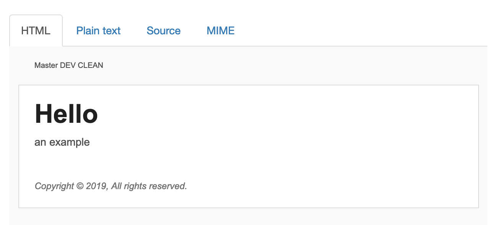
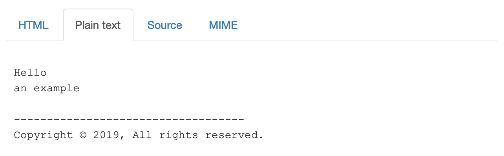

# TYPO3 extension `templatedMail`

This extension is a proof of concept how to improve the templating of mails.

**Current Benefits**

- All mails share the same layout which makes it easier to style mails
- It is faster to create nice mails


## Usage

```
$templatedMail = GeneralUtility::makeInstance(TemplatedEmail::class);
$templatedMail->addTo('dummy@example.org')
    ->addFrom('noreply@fo.com', 'Test')
    ->setSubject('A mail')
    ->htmlContent('Hello' . LF . 'an example')
    ->textContent('<h1>Hello</h1> an example')
    ->send();
```
The example can also be called by CLI with `./web/bin/typo3 mail:template`.

This example will send one mail with the following parts:

**HTML part**



**Plain text part**



## Further examples

### Using A template file

```
$templatedEmail = GeneralUtility::makeInstance(TemplatedEmail::class);
$templatedEmail->addTo('reciepient@example.org')
    ->addFrom('noreply@fo.com', 'Test')
    ->setSubject('A mail')
    ->context(['title' => 'My title'])
    ->htmlTemplateFile('EXT:templatedmail/Resources/Private/Templates/Examples/Example.html')
    ->send();
```

### Using A template

```
$templatedEmail = GeneralUtility::makeInstance(TemplatedEmail::class);
$templatedEmail->addTo('dummy@example.org')
    ->addFrom('noreply@fo.com', 'Test')
    ->setSubject('A mail')
    ->setTemplateRootPaths(['EXT:dummy/Resources/Private/Templates/'])
    ->context(['title' => 'My title'])
    ->htmlTemplateName('Examples/Simple')
    ->textTemplateName('Examples/Simple')
    ->send();
```

## Configuration

The paths are configured in the site configuration

```
templatedMail:
  templateRootPath: EXT:templatedmail/Resources/Private/Templates/
  partialRootPath: EXT:templatedmail/Resources/Private/Partials/
  layoutRootPath: EXT:templatedmail/Resources/Private/Layouts/
```

If a mail is sent via CLI, the used site can be set with `$templatedEmail->setSite($site);`

## Requirements

- TYPO3 8.7 / 9.5 LTS
- GPL License
